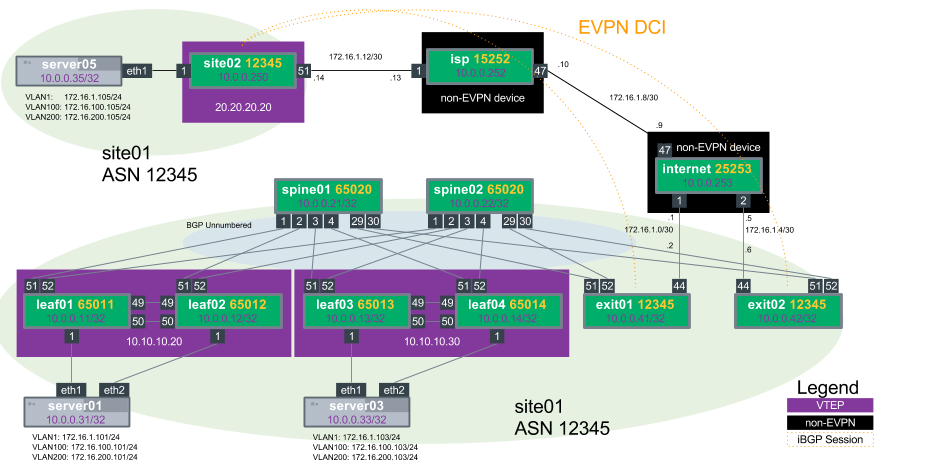

Demo EVPN on Cumulus Linux
========================
This Github repository contains the configuration files necessary for setting up EVPN (Ethernet VPN) using Cumulus Linux and Quagga on the [Reference Topology](http://github.com/cumulusnetworks/cldemo-vagrant).  Only Server01->Server04, Leaf01->Leaf04 and Spine01->Spine02 are used.

The flatfiles in this repository will set up a BGP unnumbered routing fabric between the leafs and spines, and will trunks between switches and the servers in that rack.

Quickstart: Run the Single-Attach Demo
------------------------
    git clone https://github.com/cumulusnetworks/cldemo-evpn
    cd cldemo-evpn
    vagrant up oob-mgmt-server oob-mgmt-switch
    vagrant up leaf01 leaf02 leaf03 leaf04 spine01 spine02 server01 server02 server03 server04
    vagrant ssh oob-mgmt-server
    sudo su - cumulus
    ssh server01
    ping 172.16.1.104

Quickstart: Run the Dual-Attach (MLAG) Demo
------------------------
    git clone https://github.com/cumulusnetworks/cldemo-evpn
    cd cldemo-evpn
    git checkout mlag
    vagrant up oob-mgmt-server oob-mgmt-switch
    vagrant up leaf01 leaf02 leaf03 leaf04 spine01 spine02 server01 server02 server03 server04
    vagrant ssh oob-mgmt-server
    sudo su - cumulus
    ssh server01
    ping 172.16.1.103

Quickstart: Run the DCI (Datacenter Interconnect) iBGP Demo
------------------------
NOTE: Due to the size the DCI demo is only supported on KVM

    git clone https://github.com/cumulusnetworks/cldemo-evpn
    cd cldemo-evpn
    git checkout dci
    vagrant up oob-mgmt-server oob-mgmt-switch
    vagrant up
    vagrant ssh oob-mgmt-server
    sudo su - cumulus
    ssh server01
    ping 172.16.1.105

DCI iBGP Demo Notes:

* There are two sites, site01 and site02
* For the iBGP Demo site01 and site02 shared an ASN (12345)
* Config Notes:
  * for the DCI connection the BGP keyword alowas-in is used so we can accept routes from other sites that share the same ASN
  * for the connection to the Provider Edge (in this case the "internet" device) the exit leafs set their BGP weight to always prefer this route
  * There are 3 peer-groups from the exit leaf perspective
    * EDGE, the connection to the "internet" device to route out of the data center
    * FABRIC, the connection internally to the spine switches
    * DCI, the connection across the internet to site02.  This comes up after reachability to site02 comes up.

Requirements
----------------------
[Vagrant](https://www.vagrantup.com/) (recommended 1.8.6 or 1.8.7)

and

[VirtualBox](https://www.virtualbox.org/wiki/Downloads) or [KVM](http://www.linux-kvm.org/page/Downloads)

Factory-reset a device
----------------------
    vagrant destroy -f leaf01
    vagrant up leaf01

Destroy the entire topology
---------------------------
    vagrant destroy -f

KVM Support
---------------------------
By default this Vagrantfile is setup for Virtualbox.  To use this Demo for KVM use the Vagrantfile-kvm

    mv Vagrantfile-kvm Vagrantfile

All other directions remain the same

Detailed Instructions and Documentation
---------------------------------------
[EVPN Documentation](https://docs.cumulusnetworks.com/display/DOCS/Ethernet+Virtual+Private+Network+-+EVPN)
The EVPN Documentation was built around this demo and makes walking through this demo a breeze.  Please report problems with this demo using the "issues" tab above.

### Cumulus Community

Need help?  Post on the [Community](https://getsatisfaction.cumulusnetworks.com/cumulus) or join [Cumulus Slack](https://slack.cumulusnetworks.com/)

### Cumulus Linux
---------------------------------------
Cumulus Linux is a software distribution that runs on top of industry standard networking hardware. It enables the latest Linux applications and automation tools on networking gear while delivering new levels of innovation and flexibility to the data center.

For further details please see: [cumulusnetworks.com](http://www.cumulusnetworks.com)

### Virtualizing a Network with Cumulus VX
---------------------------------------
[Cumulus VX](https://cumulusnetworks.com/cumulus-vx/) is a virtual machine
produced by Cumulus Networks to simulate the user experience of configuring a
switch using the Cumulus Linux network operating system.
[Vagrant](https://www.vagrantup.com/) is an open source tool for quickly
deploying large topologies of virtual machines. Vagrant and Cumulus VX can be
used together to build virtual simulations of production networks to validate
configurations, develop automation code, and simulate failure scenarios.

Vagrant topologies are described in a Vagrantfile, which is a Ruby program that
tells Vagrant which devices to create and how to configure their networks.
`vagrant up` will execute the Vagrantfile and create the reference topology
using Virtualbox. It will also use Ansible to configure the out-of-band
management network.
