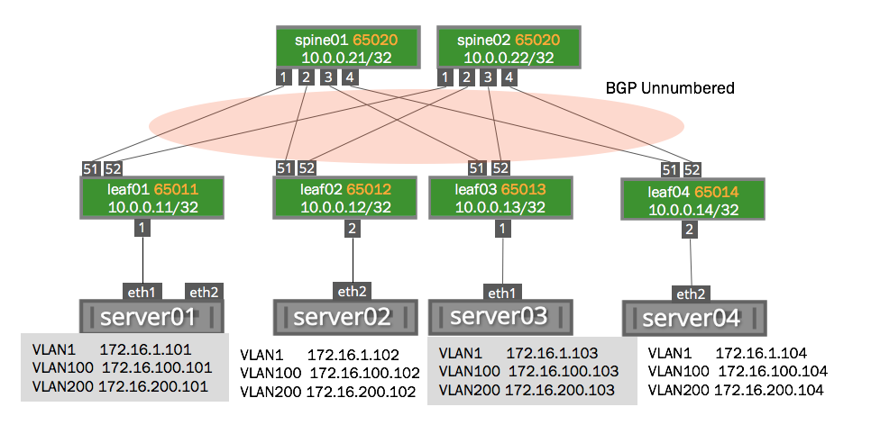
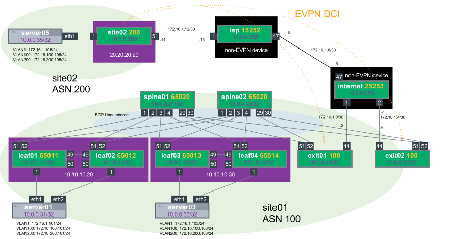

# DEPRECATED
## This repo is no longer maintained. For a list of current demos, please visit: https://gitlab.com/cumulus-consulting/goldenturtle/   

## Cumulus Networks EVPN Demos for [Cumulus VX](https://cumulusnetworks.com/products/cumulus-vx/)

Need help?  Post on the [Community](https://getsatisfaction.cumulusnetworks.com/cumulus) or join [Cumulus Slack](https://slack.cumulusnetworks.com/)

------------------------

This Github repository contains the configuration files necessary for setting up EVPN (Ethernet VPN) using Cumulus Linux and Quagga on the [Reference Topology](http://github.com/cumulusnetworks/cldemo-vagrant).

The [configuration files](config/) in this repository will set up a BGP unnumbered routing fabric between the leafs and spines, and will trunks between switches and the servers in that rack.

Quickstart: Single-Attach Demo
------------------------
    git clone https://github.com/cumulusnetworks/cldemo-evpn
    cd cldemo-evpn
    vagrant up oob-mgmt-server oob-mgmt-switch
    vagrant up leaf01 leaf02 leaf03 leaf04 spine01 spine02 server01 server02 server03 server04
    vagrant ssh oob-mgmt-server
    sudo su - cumulus
    ssh server01
    ping 172.16.1.104

[Troubleshooting Commands](https://docs.cumulusnetworks.com/display/DOCS/Ethernet+Virtual+Private+Network+-+EVPN#EthernetVirtualPrivateNetwork-EVPN-CumulusLinuxOutputCommands)    

Quickstart: Dual-Attach (MLAG) Demo
------------------------
    git clone https://github.com/cumulusnetworks/cldemo-evpn
    cd cldemo-evpn
    git checkout mlag
    vagrant up oob-mgmt-server oob-mgmt-switch
    vagrant up leaf01 leaf02 leaf03 leaf04 spine01 spine02 server01 server02 server03 server04
    vagrant ssh oob-mgmt-server
    sudo su - cumulus
    ssh server01
    ping 172.16.1.103

[Troubleshooting Commands](https://docs.cumulusnetworks.com/display/DOCS/Ethernet+Virtual+Private+Network+-+EVPN#EthernetVirtualPrivateNetwork-EVPN-CumulusLinuxOutputCommands)    

Quickstart: DCI (Datacenter Interconnect) iBGP Demo
------------------------
NOTE: Due to the size the DCI demo is only supported on KVM

    git clone https://github.com/cumulusnetworks/cldemo-evpn
    cd cldemo-evpn
    git checkout dci
    vagrant up oob-mgmt-server oob-mgmt-switch
    vagrant up
    vagrant ssh oob-mgmt-server
    sudo su - cumulus
    ssh server01
    ping 172.16.1.105

[Troubleshooting Commands](https://docs.cumulusnetworks.com/display/DOCS/Ethernet+Virtual+Private+Network+-+EVPN#EthernetVirtualPrivateNetwork-EVPN-CumulusLinuxOutputCommands)    

DCI iBGP Demo Notes:

* There are two sites, site01 and site02
* For the iBGP Demo site01 and site02 shared an ASN (12345)
* Config Notes:
  * for the DCI connection the BGP keyword alowas-in is used so we can accept routes from other sites that share the same ASN
  * for the connection to the Provider Edge (in this case the "internet" device) the exit leafs set their BGP weight to always prefer this route
  * There are 3 peer-groups from the exit leaf perspective
    * EDGE, the connection to the "internet" device to route out of the data center
    * FABRIC, the connection internally to the spine switches
    * DCI, the connection across the internet to site02.  This comes up after reachability to site02 comes up.

Quickstart: DCI (Datacenter Interconnect) eBGP Demo
------------------------
NOTE: Due to the size the DCI demo is only supported on KVM

    git clone https://github.com/cumulusnetworks/cldemo-evpn
    cd cldemo-evpn
    git checkout ebgp-dci
    vagrant up oob-mgmt-server oob-mgmt-switch
    vagrant up
    vagrant ssh oob-mgmt-server
    sudo su - cumulus
    ssh server01
    ping 172.16.1.105

[Troubleshooting Commands](https://docs.cumulusnetworks.com/display/DOCS/Ethernet+Virtual+Private+Network+-+EVPN#EthernetVirtualPrivateNetwork-EVPN-CumulusLinuxOutputCommands)    

DCI eBGP Demo Notes:

* There are two sites, site01 and site02
* For the eBGP Demo site01 is ASN100 and site02 is using ASN 200
* There is an eBGP connection (the DCI) between exit01/exit02 and the site02 Cumulus VX instance
* Config Notes:
  * for the connection to the Provider Edge (in this case the "internet" device) the exit leafs set their BGP weight to always prefer this route
  * the BGP capability eBGP multi-hop `neighbor DCI ebgp-multihop` is used to allow an eBGP connection between loopbacks across the internet
  * There are 3 peer-groups from the exit leaf perspective
    * EDGE, the connection to the "internet" device to route out of the data center
    * FABRIC, the connection internally to the spine switches
    * DCI, the connection across the internet to site02.  This comes up after reachability to site02 comes up.

### Detailed Instructions and Documentation
---------------------------------------
[EVPN Documentation](https://docs.cumulusnetworks.com/display/DOCS/Ethernet+Virtual+Private+Network+-+EVPN)
The EVPN Documentation was built around this demo and makes walking through this demo a breeze.  Please report problems with this demo using the "issues" tab above.

## Troubleshooting Commands

 * `bridge fdb show` shows the mac-address table for local and remote VTEPs
 * `show ip bgp summary` shows BGP IPv4 neighbor adjacencies
 * `show bgp evpn summary` shows BGP EVPN neighbor adjacencies
 * `show bgp evpn vni` shows VNIs that this device is participating in (only works on a VTEP)
 * `show evpn vni` shows remote VTEPs that share VNIs that this switch is participating in (only works on a VTEP)
 * `show evpn mac vni all` show MAC address information learned per VNI
 * `show bgp evpn route` show all EVPN routes

### Requirements
----------------------
[Vagrant](https://www.vagrantup.com/) (recommended 1.8.6 or 1.8.7)

and

[VirtualBox](https://www.virtualbox.org/wiki/Downloads) or [KVM](http://www.linux-kvm.org/page/Downloads)

Factory-reset a device
----------------------
    vagrant destroy -f leaf01
    vagrant up leaf01

Destroy the entire topology
---------------------------
    vagrant destroy -f

KVM Support
---------------------------
By default this Vagrantfile is setup for Virtualbox.  To use this Demo for KVM use the Vagrantfile-kvm

    mv Vagrantfile-kvm Vagrantfile

All other directions remain the same

### Cumulus Linux
---------------------------------------
Cumulus Linux is a software distribution that runs on top of industry standard networking hardware. It enables the latest Linux applications and automation tools on networking gear while delivering new levels of innovation and flexibility to the data center.

For further details please see: [cumulusnetworks.com](http://www.cumulusnetworks.com)
